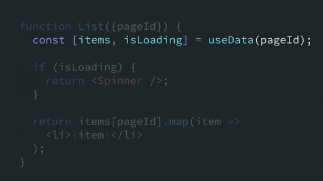

# React 18 study

날짜: May 22, 2022
주제: React18

- Concurrency (동시성)
    
    
    - 한 줄 요약 : DOM 렌더링 끼어들기 가능!
    
    - Intro
        - 리액트가 여러가지 버전의 ui 를 동시에 준비할 수 있게하는, 작동 매커니즘이며 그 자체로 하나의 기능인 것은 아님.
        - 리액트를 이용하는 개발자들은 어떤 ux 를 전달할 것인지에 집중하고, 리액트는 그 ux 를 개발자들이 어떻게 전달할지에 대해 집중하기 때문에 리액트를 이용하는 개발자들이 리액트 내부에서 동시성이 어떻게 작동하는지에 대해 아는 것 까지는 기대하지 않음.
        - 하지만 동시성은 리액트의 코어 랜더링 모델에 대한 기초적 업데이트이기 때문에 어떻게 작동하는지 알아두면 도움이 될 수도..?
    
    - Main
        - 동시성에서 가장 중요한 특성은 interruptible(끼어들기 가능)
        - 기존에는 어떤 것에도 방해받지 않고, 순서에 끼어듦도 없는 온전한 동기적 transaction 이 일어남. 따라서 한 번 update 가 일어나서 랜더링이 시작되면 유저가 그 결과를 보기 전까지 그 어떤 것도 끼어들 수 없었음.
        - concurrent render(동시 렌더) 에서는?
            - 업데이트 발생 후 렌더링 중 중간에 잠시 멈췄다가 나중에 다시 진행하는 것이 가능함.
            - 만일 렌더링에 ‘끼어들기’ 가 발생해도 리액트는 ui 가 일관적으로 나타나도록 보장함.
            - 모든 DOM tree 의 평가와 DOM mutation 이 끝날 때까지 기다릴 수 있기 때문에 메인 쓰레드를 blocking 하지 않고 뒤에서 새로운 화면을 준비할 수 있음.
                - UI 가 엄청 큰 랜더링을 하는 중에도 사용자의  input에 즉각적으로 반응할 수 있다!
            - ui 의 일정 부분만 지웠다가 이전의 state 와 함께 다시 그 부분을 추가할 수 있다
                - 유저가 다른 탭을 갔다가 오면 리액트는 유저가 다른 탭으로 떠나기 전의 화면을 그 전의 상태 그대로 유저에게 보여줄 수 있다.
            
    - Outro
        - 리액트 팀은 동시성 api(ex. [useTransition](https://reactjs.org/docs/hooks-reference.html#usetransition)) 를 직접적으로 부르기보다 동시성 기능이 지원되는 라이브러리나 프레임워크를 이용하는 것을 기대하고 있음.
        
    - Source
        - [React v18.0](https://reactjs.org/blog/2022/03/29/react-v18.html)
        
- React 18 keynote 18:04
    
    React 18 keynote
    
    [https://www.youtube.com/watch?v=FZ0cG47msEk&list=PLNG_1j3cPCaZZ7etkzWA7JfdmKWT0pMsa&index=1](https://www.youtube.com/watch?v=FZ0cG47msEk&list=PLNG_1j3cPCaZZ7etkzWA7JfdmKWT0pMsa&index=1)
    
    [https://www.youtube.com/watch?v=FZ0cG47msEk&t=125s](https://www.youtube.com/watch?v=FZ0cG47msEk&t=125s)
    
    **React’s APIs** are rooted primarily in **design principles**, not programming.
    
    [https://youtu.be/FZ0cG47msEk?t=187](https://youtu.be/FZ0cG47msEk?t=187)
    
    When designers and programmers speak different languages, the user experience gets lost in translation.
    
    [https://youtu.be/FZ0cG47msEk?t=207](https://youtu.be/FZ0cG47msEk?t=207)
    
    React didn’t really invent components, designers had been using them in their tools for decades.
    
    But what React did was it **made components a mainstream part of UI developmen**t.
    
    [https://youtu.be/FZ0cG47msEk?t=328](https://youtu.be/FZ0cG47msEk?t=328)
    
    Suspense expands our notion of what a component can be.
    
    [https://youtu.be/FZ0cG47msEk?t=417](https://youtu.be/FZ0cG47msEk?t=417)
    
    When we think about React, one of the nice properties that makes the React model so good is that you can usually read components **from top to bottom** to understand what they’re doing.
    
    It’s declarative and it feels Reacty.
    
    하지만 Data fetching이 추가되면 코드 순서가 복잡해진다.
    
    [https://youtu.be/FZ0cG47msEk?t=488](https://youtu.be/FZ0cG47msEk?t=488)
    
    Data fetching library(Apollo, useSWR, React Query)를 이용하면 다시 코드를 top-down으로 작성할 수 있다.(relay도 끼워주세요…)
    
    
    
    여기서 더 개선된 점은?
    
    [https://youtu.be/FZ0cG47msEk?t=526](https://youtu.be/FZ0cG47msEk?t=526)
    
    2가지 관심사가 혼재돼 있다.
    
    
    
    
    
    이 경우 생기는 문제점:
    
    
    
    - 어떤 특정한 컴포넌트에 데이터를 넣어주기가 어려워진다. 새로 추가되는 데이터마다 loading state도 지정해주어야 하기 때문. (workflow에 단계가 하나 추가되는 셈)
    - loading state를 변경하고 싶다면 fetching logic에 손을 대야해서 일이 커진다.
        - 기존에 컴포넌트 2개에서 각각 읽어왔던 데이터를 spinner 하나로 관리하고 싶다면, Data queries를 부모 컴포넌트로 올려줘야한다.
    
    
    
    → 
    
    
    
    해결책은 isLoading boolean을 컴포넌트에서 빼버리는 것. 이제 Data Fetching Library는 data 자체만 반환해주고, 따라서 코드를 top-down으로 읽을 수 있게 된다. 데이터가 비동기로 (이후에) 들어온다면 Data Fetching Library가 React에게 알려준다.
    
    
    
    Loading state는 부모 컴포넌트 단으로 넘어간다.
    
    
    
    This is similar to skeletons and loading states that designers use in their language. You have a piece of UI and you have a fallback for when that a piece of UI is not available.
    
    And so the key point here is that we think that the right place for the loading state is inside the JSX. And this is exactly what the Suspense component is, a React component that lets you specify in a declarative way, right inside your JSX that **when a part of the UI is not ready, we want to show something different in the meantime.e**
    
    이제 아래 두 가지 작업이 분리되었기 때문에 workflow가 개선될 수 있다:
    
    
    
    - 새로 데이터 레이어가 추가되어도, 이 레이어의 loading state는 자동적으로 가장 가까운 부모 Suspence 컴포넌트에서 처리된다.
    
    
    
    - loading state를 보여주는 단위를 변경할 때도 더 이상 어느 컴포넌트에서 어느 데이터를 읽어오는지를 고려하지 않아도 된다.
    
    
    
    →
    
    
    
    디자이너와의 협업 관점에서도 유리하지만 기술적으로도 유리하다.
    
    데이터 뿐 아니라 다른 종류의 리소스에도 Suspence를 사용할 수 있기 때문.
    
    
    
    Stream server rendering:
    
    placeholder HTML → (if the whole content ready) → actual content HTML
    
    
    
    (next - 서버사이드 렌더링에서 여기를 처리할 수 있을까?)
    
    →
    
    
    
    (next - 데이터가 완료된 건에 대해서는 클라이언트에서 해주고 있는 것 같다 ?)
    
    server side props에서 fetch를 날려서, 데이터를 받아서 완성된 HTML을 뿌려준다.
    

### Nested Suspense: 다음주 숙제

```jsx
<Suspense fallback={<div>1</div>}>
  <Suspense fallback={<div>2</div>}>
		<Suspense fallback={<div>3</div>}></Suspense>
  </Suspense>
  <Suspense fallback={<div>4</div>}>
    <Suspense fallback={<div>5</div>}></Suspense>
    <Suspense fallback={<div>6</div>}></Suspense>
  </Suspense>
  <Suspense fallback={<div>7</div>}>
    <Suspense fallback={<div>8</div>}></Suspense>
  </Suspense>
</Suspense>
```

:  하위에 리소스를 주입을 하는데 내부에서 로딩이 완료되면 보여주고, 안 됐으면 안 보여준다.

Q) 전부 data fetching logic이 달려있다고 할 때, 보이지 않은 상태(컴포넌트가 fallback인 상태)에서 API call이 날아가는 건가?

1번(처음 페이지 들어갔을 때만 작동)

→ 2, 4, 7번은 각각 독립적으로 작동

→ Q) 3번이 rendering 되었을 때 2번은 보이나?

→ 2번(상대적으로 가벼운 로직/로컬) fallback 걸린 상태에서 2번 보이고 3번 fallback

### React 18 Suspense Rendering Order Test

```jsx
// index.jsx
import React from "react";
import { createRoot } from "react-dom/client";
import App from "./App";

const container = document.getElementById("root");
const root = createRoot(container);
root.render(
  <React.StrictMode>
    <App />
  </React.StrictMode>,
);

// App.jsx
import React, { Suspense } from "react";
import PropTypes from "prop-types";

const Fallback = ({ text }) => <div>{`Fallback-${text}`}</div>;

Fallback.propTypes = {
  text: PropTypes.number.isRequired,
};

const mockLazyImport = (text, delay) => new Promise(
  (resolve) => {
    setTimeout(() => resolve({ default: () => <div>{text}</div> }), delay);
  },
);

const LazyComponent1 = React.lazy(() => mockLazyImport(1, 1000));
const LazyComponent2 = React.lazy(() => mockLazyImport(2, 0));
const LazyComponent3 = React.lazy(() => mockLazyImport(3, 0));
const LazyComponent4 = React.lazy(() => mockLazyImport(4, 0));
const LazyComponent5 = React.lazy(() => mockLazyImport(5, 0));

function App() {
  return (
    <div>
      <Suspense fallback={<Fallback text={1} />}>
        <LazyComponent1 />
        <Suspense fallback={<Fallback text={2} />}>
          <LazyComponent2 />
          <Suspense fallback={<Fallback text={3} />}>
            <LazyComponent3 />
            <Suspense fallback={<Fallback text={4} />}>
              <LazyComponent4 />
              <LazyComponent5 />
            </Suspense>
          </Suspense>
        </Suspense>
      </Suspense>
    </div>
  );
}

export default App;
```